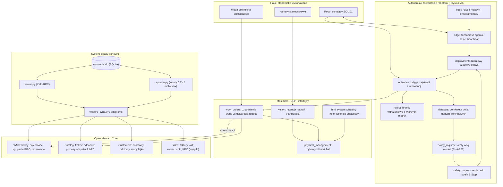

# Sortownia odpadów: most legacy, moduły hali i Open Mercato

Integracja systemu gospodarki odpadami z platformą Open Mercato: od symulatora
systemu legacy (XML-RPC w dialekcie webERP), przez obsługę procesów magazynowych
i sprzedażowych (WMS, CRM, KPO), po warstwę wykonawczą robotów sortujących na hali
(Physical AI) i most uzgadniający zapasy z wagą.

## Uczciwa etykieta

* **To nie jest webERP.** Część legacy mówi dialektem XML-RPC prawdziwego webERP:
  te same nazwy metod (`weberp.xmlrpc_*`), ta sama mechanika sesji (logowanie
  zwraca kod liczbowy, autoryzacja jedzie ciasteczkiem `PHPSESSID`), te same nazwy
  pól (`debtorno`, `stockid`, `loccode`, `qty`) i ścieżka endpointu
  (`/api/api_xml-rpc.php`). Zmiana URL-a przestawia klienta na rzeczywistą
  instancję webERP.
* **Żadnych metod wymyślonych.** Powierzchnia XML-RPC zawiera wyłącznie metody
  istniejące w webERP. Dane, których webERP przez API nie wystawia (katalog
  kontrahentów, katalog frakcji, księga ruchów), przychodzą kanałem plikowym
  ze zrzutów (CSV/XLSX).
* **Waga rozstrzyga o zapasie, deklaracja robota o ocenie robota.** Robot
  sortujący zgłasza liczbę wykonanych chwytów, ale do stanu magazynowego WMS trafia
  wyłącznie masa zarejestrowana przez wagę pod pojemnikiem odkładczym. Rozjazd
  wpływa na ocenę sprawności maszyny w module wdrożeń, nie na stan ewidencyjny.

---

## Architektura systemu

System składa się z trzech współpracujących warstw zintegrowanych w ramach
modułów Open Mercato:



---

## 1. Integracja z systemem legacy (`sortownia`)

Stary system sortowni zasila platformę dwoma kanałami:

1. **XML-RPC (`legacy/server.py`)** — metody webERP: `xmlrpc_Login`,
   `xmlrpc_GetCustomer`, `xmlrpc_GetLocationList`, `xmlrpc_GetLocationDetails`,
   `xmlrpc_GetStockBalance`, `xmlrpc_GetSalesOrderHeader`.
2. **Zrzut plikowy (`legacy/spooler.py`)** — katalog kontrahentów
   (`kontrahenci.csv`), katalog frakcji (`frakcje.csv`), zamówienia
   (`zamowienia.csv`), zapłaty (`zaplaty.csv`) oraz księga ruchów
   (`ruchy.xlsx` czytana bez zewnętrznych bibliotek).

### Mapowanie danych na Open Mercato

| Legacy (SIMAG / webERP) | Open Mercato | Rozwiązanie |
| --- | --- | --- |
| `locations` (`PRZYJ`, `BOKS1‑4`, `MAGRDF`) | `wms_warehouses` → `wms_warehouse_zones` → `wms_warehouse_locations` | Konfiguracja typów (`staging`/`bin`) oraz `capacity_weight` (pojemność boksów w kg). |
| `stockmaster` (frakcje) | `catalog_products` + `catalog_product_variants` | SKU jako kod odpadu, jednostka kg, kod odzysku (R1, R3, R4, R5). |
| `locstock` | `wms_inventory_balances` | Salda `on_hand`, `reserved`, `allocated` per partia i lokalizacja. |
| `stockmoves` `PZ` | `wms.inventory.receive` | Przyjęcie na plac z utworzeniem partii (`wms_inventory_lots`) dostawcy. |
| `stockmoves` `SORT` (para wierszy) | `wms.inventory.move` | Złożenie pary w jeden atomowy ruch `transfer` z rozbiciem FIFO po partiach. |
| `stockmoves` `WZ` | `wms.inventory.adjust` | Wydanie do odbiorcy powiązane z zamówieniem sprzedaży. |
| `stkmoveno` | `idempotency_key` WMS | Deterministyczny `referenceId` — powtórzony import nie duplikuje stanów. |
| `debtorsmaster` | `customer_entities` + `customer_companies` | NIP, numer rejestrowy BDO, podział na dostawców i odbiorców w CRM. |
| `salesorders` | `sales_orders` + `sales_order_lines` | Pozycje zamówień z ceną za kg i stawką VAT. |
| — | `sales_invoices` | Faktury z numeracją platformy (`INV-...`). |
| `debtortrans` | `sales_payments` | Rozliczenia powiązane z fakturami, wiekowanie należności. |
| — | `sales_shipments` | Karta przekazania odpadu (KPO) z masą, procesem odzysku i numerami BDO. |

### Sekwencja importu

Kolejność kroków w komendzie `yarn mercato sortownia import` wynika z zależności
danych:

```
topologia → frakcje → kontrahenci → zamówienia (+ faktury)
          → karty przekazania → wpłaty → partie odpadu → księga ruchów → rezerwacje → CRM
```

Rezerwacje magazynowe pod otwarte zamówienia są nakładane **po** zaksięgowaniu
ruchów — przed ruchami magazyn jest pusty, a rezerwacja na placu przyjęć
blokowałaby masę przed jej wysortowaniem.

---

## 2. Warstwa wykonawcza hali (Physical AI, fazy 0–6)

Zestaw modułów zarządzających pracą robotów sortujących:

* **`fleet`**: Rejestr robotów, typy embodimentów (manipulator SO-101), relacja
  właściciel/operator, śledzenie ważności kalibracji.
* **`edge`**: Tożsamość kryptograficzna maszyn, uwierzytelnianie sesji, zamiatanie
  martwych agentów (heartbeat sweep) i emisja zdarzeń `edge.agent.lost`.
* **`policy_registry`**: Rejestr wersji modeli. Identyfikatorem jest skrót wag
  (SHA-256), a nie etykieta. Weryfikacja zgodności przestrzeni obserwacji i akcji.
* **`safety`**: Formalne dopuszczenia celi. Wymóg ważnej kalibracji, stref
  bezpieczeństwa i procedur E-Stop przed wydaniem dzierżawy.
* **`deployment`**: Krótkoterminowe dzierżawy (lease) polityk na maszynach. Brak
  heartbeatu powoduje automatyczne wygaśnięcie uprawnień do ruchu.
* **`episodes`**: Rejestr przebiegów i trajektorii. Interwencja operatora jest
  zapisywana jako obiekt z przyczyną, nie jako flaga na epizodzie.
* **`rollout`**: Stopniowe wdrażanie (canary). Bramki weryfikują twarde liczby
  z księgi epizodów (poślizgi, skuteczność chwytu), odrzucając subiektywne oceny.
* **`datasets`**: Domknięcie pętli danych. Epizody z interwencjami trafiają do
  zbiorów korekcyjnych, z których powstają kolejne wersje polityk.

---

## 3. Most hala ↔ ERP (`work_orders`)

Moduł `work_orders` łączy telemetrię gniazda sortowniczego z ewidencją
magazynową Open Mercato.

### Zasada rozstrzygania rozjazdów

1. Robot zgłasza: *„wykonałem 1000 chwytów”* (szacunek: 30,00 kg przy masie nominalnej 30 g).
2. Waga pod pojemnikiem odkładczym wskazuje: *24,00 kg*.
3. **Decyzja:**
   * Do magazynu WMS trafia **24,00 kg** jako przyjęcie partii surowca (`wms.inventory.receive`).
   * Różnica (-6,00 kg) generuje werdykt **`overclaim`** i obniża ocenę sprawności robota w module wdrożeń.
   * Materiał nie jest blokowany na linii — rozjazd dotyczy oceny maszyny, nie fizycznego surowca.

Jednostką rozliczeniową wewnątrz modułu są **gramy w liczbach całkowitych**, co
eliminuje błędy zaokrągleń przy sumowaniu tysięcy operacji.

---

## 4. Interfejsy i pulpity operatorskie

* **Pulpit sortowni (`/backend/sortownia`)**: Poziom napełnienia boksów
  względem pojemności (progi 70% i 90%), bilans masy przyjętej, wysortowanej
  i wydanej, wskaźniki należności oraz historia ruchów z powiązaniem do kwitów
  legacy.
* **Cyfrowy bliźniak hali (`/backend/physical-management`)**: Rzut hali (Plant
  View), status gniazd SO-101, wskaźniki ważenia i podgląd stanu zleceń.
* **Zarządzanie flotą i bezpieczeństwem (`/backend/safety`, `/backend/rollout`)**:
  Tablica dopuszczeń celi, aktywne dzierżawy i wskaźniki bramek wdrożeniowych.
* **System wizualny HMI (`hmi`)**: Ścisła reguła przemysłowa: stan normalny jest
  szary, barwy ostrzegawcze pojawiają się wyłącznie w przypadku anomalii i awarii.

---

## Struktura repozytorium

```
openmercato_garbagekind/
├── legacy/                    Symulator systemu legacy (Python, stdlib)
│   ├── schema.sql             Schemat bazy danych (tabele webERP)
│   ├── generate.py            Generator bazy ze stałym ziarnem (powtarzalny)
│   ├── server.py              Serwer XML-RPC (6 metod webERP)
│   ├── spooler.py             Cykliczny eksport katalogów i ruchy.xlsx
│   ├── xlsx.py                Czytnik arkuszy .xlsx bez zależności zewnętrznych
│   ├── sortownia.db           Baza SQLite
│   └── wsad/                  Katalog zrzutów plikowych
│
├── client/                    Klient integracyjny legacy (Python)
│   └── weberp_sync.py         Pobiera dane z XML-RPC i plików → generuje CSV
│
├── out/                       Zrzuty wyjściowe dla Open Mercato
│   ├── kontrahenci.csv, frakcje.csv, lokalizacje.csv, stany.csv, ruchy.csv, ...
│   └── .last_sync             Znacznik synchronizacji przyrostowej
│
├── mercato/                   Moduły Open Mercato (TypeScript / Next.js)
│   ├── install.sh             Skrypt instalacji modułów w instancji Open Mercato
│   └── modules/
│       ├── sortownia/         Most legacy: WMS, CRM, Sales, KPO, pulpit
│       ├── physical_management/ Cyfrowy bliźniak hali i podgląd celi
│       ├── fleet/             Rejestr maszyn, embodimenty (SO-101), kalibracje
│       ├── edge/              Agent brzegowy, tożsamość kryptograficzna, sesje
│       ├── policy_registry/   Modele AI, skróty wag (SHA-256), zgodność DOF
│       ├── safety/            Dopuszczenia celi, strefy bezpieczeństwa, E-Stop
│       ├── deployment/        Dzierżawy czasowe polityki na robocie
│       ├── episodes/          Księga trajektorii i interwencji ludzkich
│       ├── rollout/           Bramki wdrożeniowe oparte na wskaźnikach
│       ├── datasets/          Domknięcie pętli danych treningowych
│       ├── work_orders/       Most hala ↔ ERP (waga vs deklaracja robota)
│       ├── vision/            Wizja maszynowa, triangulacja, retencja nagrań
│       └── hmi/               Paleta przemysłowa i komponenty HMI
│
├── physical-ai/               Specyfikacje techniczne i dokumentacja hali
│   ├── ROADMAP.md, README.md, ERP-BRIDGE.md, EMBODIMENTS.md, ...
│
├── webui/                     Poglądowa makieta UI starego systemu
│   └── simag.html             Statyczny podgląd interfejsu SIMAG 3.11
│
├── tests/                     Testy integracyjne legacy (Python)
│   └── test_end_to_end.py     Zestaw 19 testów weryfikacyjnych
│
└── run_demo.sh                Skrypt demonstracyjny end-to-end
```

---

## Uruchomienie

Wymagania: **Python 3.11+** (tylko biblioteka standardowa) oraz sklonowane
środowisko **Open Mercato** z Node.js i Yarn.

### Demo end-to-end (kanał legacy)

```bash
./run_demo.sh                              # generator -> serwer + spooler -> klient pełny -> przyrostowy
PAUSE=5 ./run_demo.sh --reserve-step 3     # wariant przyspieszony
```

### Krok po kroku

1. **Baza i zrzuty legacy:**
   ```bash
   python3 legacy/generate.py --db legacy/sortownia.db --wsad legacy/wsad
   ```
2. **Serwer XML-RPC i spooler:**
   ```bash
   python3 legacy/server.py --db legacy/sortownia.db --port 8088 &
   python3 legacy/spooler.py --db legacy/sortownia.db --wsad legacy/wsad --interval 5 &
   ```
   Konto testowe: `demo` / `demo`, firma `weberpdemo`.
3. **Pobranie danych klientem:**
   ```bash
   python3 client/weberp_sync.py --wsad legacy/wsad --out out --full
   python3 client/weberp_sync.py --out out   # tryb przyrostowy
   ```
4. **Instalacja i import w Open Mercato:**
   ```bash
   MERCATO_ROOT=/sciezka/do/open-mercato ./mercato/install.sh
   cd /sciezka/do/open-mercato/apps/mercato
   yarn generate
   yarn mercato sortownia import
   ```

---

## Stan weryfikacji i testy

* **Moduł `sortownia`:** 197 testów jednostkowych (Jest), w tym obsługa XML-RPC,
  parowanie wierszy `SORT`, rozkład FIFO na partie magazynowe, idempotencja importu
  i kalkulacja podatków na zamówieniach.
* **Moduły robotyczne Physical AI:** 329 testów jednostkowych weryfikujących
  łańcuch od rejestracji floty po domknięcie pętli w `datasets`.
* **Kanał legacy:** 19 testów integracyjnych w `tests/test_end_to_end.py`
  potwierdzających zgodność ze specyfikacją webERP (sesje, kody błędów, brak stanów
  ujemnych, poprawność sum kontrolnych NIP).
* **Bilans masy na danych testowych:**
  * Masa przyjęta: 437 131,25 kg.
  * Masa wydana: 236 353,44 kg.
  * Stan magazynowy w boksach: 200 777,81 kg.
  * Niezgodność bilansu: **0,00 kg** (sprawność procesu sortowania: 67,9%).

---

## Czego system nie robi (granice zakresu)

* **Brak bezpośredniej integracji z rządowym API BDO:** Karty przekazania
  wystawiane w module są wewnętrznym odpowiednikiem KPO na potrzeby ewidencji, nie
  dokumentami pobranymi z urzędowego rejestru.
* **Brak modułu zakupów:** Przyjęcie odpadu na plac (`PZ`) jest ruchem
  magazynowym z rejestracją partii, a nie fakturą zakupu.
* **Kwalifikacja podatkowa:** Wszystkie wyroby gotowe naliczają stawkę 23% VAT bez
  obsługi mechanizmu odwrotnego obciążenia.
* **Most hali jest jednokierunkowy:** ERP nie steruje bezpośrednio trajektorią
  robota. Zlecenia robocze wiążą ramy czasowe i wagi, zapobiegając awariom linii
  wynikającym z opóźnień sieciowych warstwy biznesowej.
