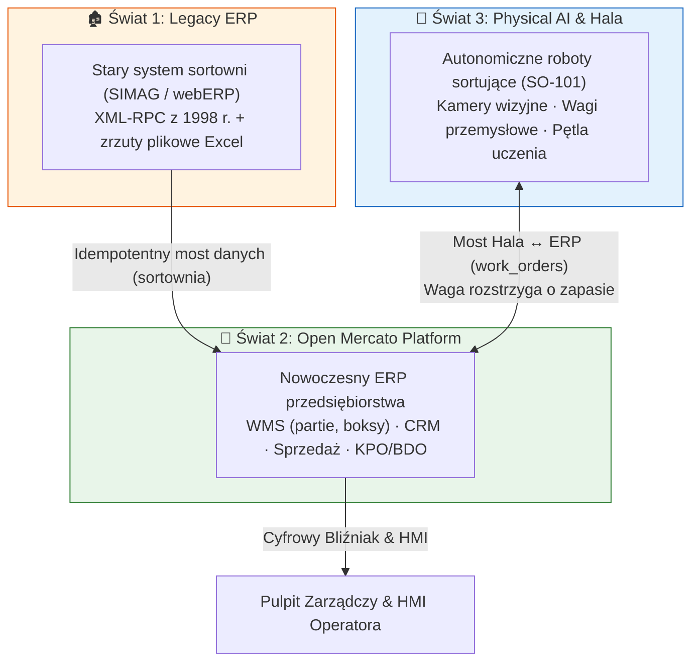
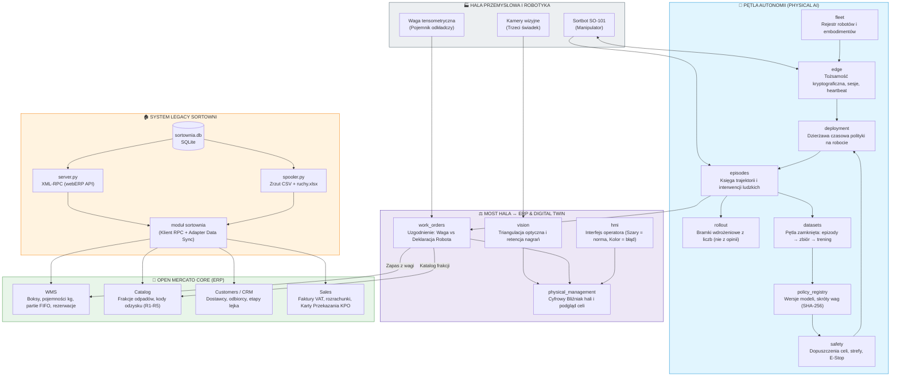
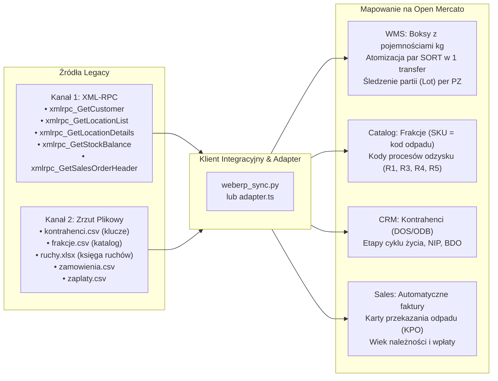
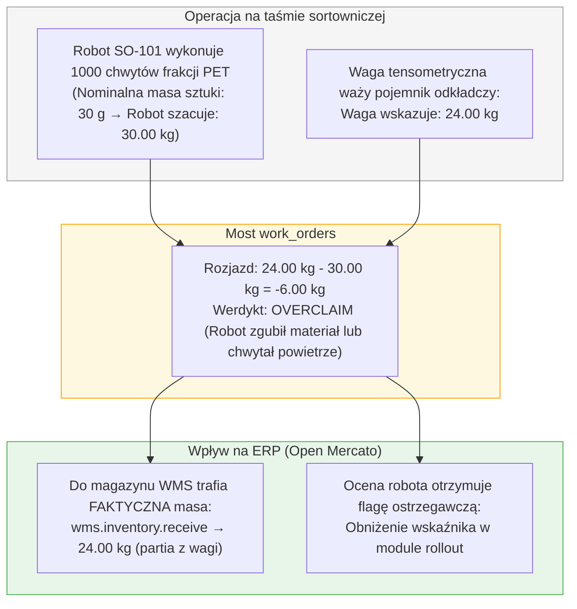
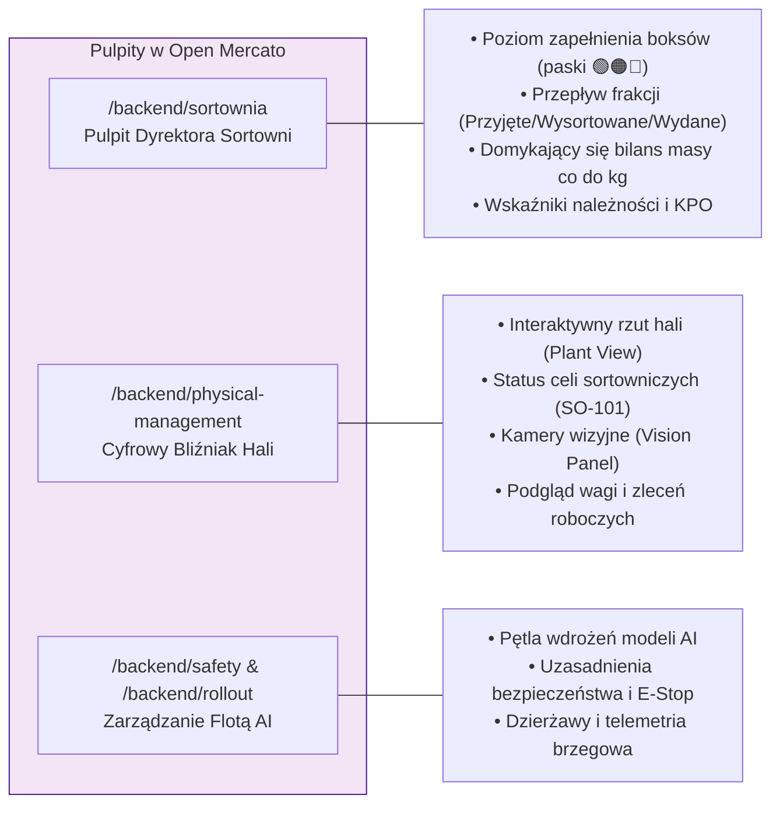

# 🏭 Open Mercato Garbagekind — Autonomiczna Sortownia Odpadów

> **Od Systemu Legacy przez Robotyke Przemysłową (Physical AI) do Nowoczesnego ERP**  
> *Kompletna platforma cyfrowo-fizyczna dla zakładów przetwarzania i odzysku odpadów.*

---

## 1. Wizja i Istota Produktu

Projekt rozwiązuje fundamentalny problem zakładów przetwarzania odpadów: **przepaść między halą przemysłową (roboty, wagi, wizja) a systemem gospodarczo-ewidencyjnym (stany magazynowe, BDO, faktury, CRM).**

Zamiast budować ERP od zera albo tworzyć roboty w oderwaniu od biznesu, integrujemy **trzy światy** w jeden spójny ekosystem:



---

## 2. Architektura Całego Produktu — Schemat Modułów

Cały system opiera się na modułowej architekturze platformy Open Mercato z podziałem na warstwę halowo-robotyczną, mosty danych oraz rdzeń biznesowy:



---

## 3. Filar 1: Legacy ERP & Most Danych (`sortownia`)

Stary system sortowni (odwzorowany wiernie według dialektu **webERP** z protokołem XML-RPC z 1998 roku) zasila Open Mercato dwoma kanałami:



### Porównanie struktur:
| Legacy (SIMAG / webERP) | Open Mercato | Co z tego wynika |
| --- | --- | --- |
| `locations` (`PRZYJ`, `BOKS1‑4`, `MAGRDF`) | `wms_warehouses` → `wms_warehouse_zones` → `wms_warehouse_locations` | typ lokalizacji (`staging`/`bin`) i **`capacity_weight`** — boks wreszcie ma pojemność |
| `stockmaster` (frakcje) | `catalog_products` + `catalog_product_variants` (SKU = kod odpadu) + `wms_product_inventory_profiles` | próg ponownego zamówienia, jednostka magazynowa, kod odzysku (R1-R5) |
| `locstock` | `wms_inventory_balances` | `on_hand` / `reserved` / `allocated` i liczona kolumna `available` |
| `stockmoves` `PZ` | komenda `wms.inventory.receive` → ruch `receipt` | rejestracja partii dostawcy (`lotNumber = PZ/no`) |
| `stockmoves` `SORT` (**para** wierszy) | komenda `wms.inventory.move` → **jeden** ruch `transfer` | przesunięcie staje się **atomowe** |
| `stockmoves` `WZ` | komenda `wms.inventory.adjust` → ruch `adjust` | powiązanie z zamówieniem sprzedaży |
| `stkmoveno` | deterministyczny `referenceId` → `idempotency_key` WMS | powtórzony import odbija się od bazy (zero duplikatów) |
| `debtorsmaster` | `customer_entities` + `customer_companies` | historia kontaktów, NIP, BDO, etapy w CRM |
| `salesorders` | `sales_orders` + `sales_order_lines` | cena za kilogram, odbiorca, stawka podatkowa |
| — *(brak w legacy)* | `sales_invoices` (komenda `sales.invoices.create`) | faktura z numerem nadanym przez platformę |
| `debtortrans` | `sales_payments` + alokacje na fakturach | rozrachunki, wiek zaległości |
| — *(brak w legacy)* | `sales_shipments` jako karta przekazania odpadu | masa, kod odpadu, proces odzysku, numery rejestrowe BDO |

### Sekwencja importu:
Kolejność importu jest wymuszona więzami integralności:
1. **Topologia** (Magazyn `SORT-WLS`, strefy `PRZYJECIA`, `BOKSY`, `PALIWO`, lokalizacje z pojemnością kg).
2. **Frakcje** (Katalog produktów + warianty SKU + kody odzysku).
3. **Kontrahenci** (Podmioty CRM z NIP, BDO i etapami).
4. **Zamówienia i Faktury** (Zlecenia sprzedaży + automatyczna numeracja faktur `INV-...`).
5. **Karty Przekazania Odpadu** (Generowane tylko dla wydań faktycznie zrealizowanych).
6. **Rozrachunki** (Wpłaty odbiorców alokowane na konkretne faktury).
7. **Partie odpadu (Lot Tracking)** (Zakładane przed księgą ruchów na podstawie PZ).
8. **Księga Ruchów** (PZ → przyjęcie, para SORT → jeden atomowy transfer FIFO po partiach, WZ → korekta ujemna).
9. **Rezerwacje** (Zakładane **po** ruchach pod zamówienia otwarte — blokują realnie leżącą masę).
10. **CRM Sync** (Spójność etapów firm i szans sprzedaży).

---

## 4. Filar 2: Physical AI & Autonomia Robotów (Fazy 0–6)

Dla robotów sortujących odpady (gniazda sortownicze SO-101 z manipulatorami przemysłowymi) stworzyliśmy **pełny łańcuch zarządzania inteligencją fizyczną**:

```mermaid
stateDiagram-v2
    direction LR
    [*] --> Fleet: Rejestr robota
    Fleet --> Edge: Autoryzacja kryptograficzna mTLS
    Edge --> PolicyRegistry: Pobranie polityki (skrót wag SHA-256)
    PolicyRegistry --> Safety: Bramka bezpieczeństwa (E-Stop, strefy)
    Safety --> Deployment: Czasowa dzierżawa zadania
    Deployment --> Episodes: Wykonanie chwytów na taśmie
    Episodes --> Rollout: Obiektywna ocena (skuteczność, poślizgi)
    Rollout --> Datasets: Zbiór danych (korekty + demonstracje)
    Datasets --> PolicyRegistry: Nowy trening i kolejna wersja
```



* **`fleet`**: Co istnieje w fabryce, jaki ma chwytak/stopnie swobody (DOF) i czy certyfikat kalibracji nie wygasł.
* **`edge`**: Kto się łączy z hali, kryptograficzny token sesji, zamiatanie martwych sesji (heartbeat sweep).
* **`policy_registry`**: Tożsamość modelu AI to skrót wag (SHA-256 digest), a nie arbitralny numer wersji. Weryfikacja zgodności przestrzeni obserwacji i akcji.
* **`safety`**: Twarde dopuszczenie do pracy w danej klasie celi sortowniczej. Zakaz uruchomienia bez aktualnej kalibracji i stref bezpieczeństwa.
* **`deployment`**: Krótkoterminowa dzierżawa (lease). Gdy agent brzegowy przestanie zgłaszać heartbeat, dzierżawa wygasa — robot nie wykonuje nieskończonych pętli.
* **`episodes`**: Rejestr każdego chwytu odpadu. Interwencja człowieka jest obiektem pierwszoklasowym.
* **`rollout`**: Progresywne wdrożenie (canary). Brama decyduje na podstawie twardych wskaźników z księgi (procent poślizgów, udanych odłożeń), a nie deklaracji.
* **`datasets`**: **Pętla zamknięta w obie strony.** Epizody z interwencją człowieka stają się zbiorem korekcyjnym, na którym trenuje się kolejna wersja polityki.

---

## 5. Filar 3: Most Hala ↔ ERP (`work_orders`)

To najważniejszy koncepcyjnie punkt styku świata fizycznego i biznesowego:

> ⚠️ **Fundamentalna reguła architektoniczna:**  
> **Waga przemysłowa rozstrzyga o stanie magazynowym, a deklaracja robota rozstrzyga o ocenie sprawności robota.**  
> *(Nigdy odwrotnie!)*



1. **Ochrona przed halucynacją AI:** Przyjęcie na stan deklaracji robota (30 kg) stworzyłoby 6 kg wirtualnego surowca w boksie.
2. **Brak blokowania linii:** Rozjazd nie blokuje przyjęcia surowca (kontener fizycznie stoi na wadze). Flaga dotyczy **maszyny**, nie surowca.
3. **Pomiary w gramach całkowitych:** Eliminacja błędów zmiennoprzecinkowych przy sumowaniu tysięcy chwytów.

---

## 6. Panele Operatorskie i Cyfrowy Bliźniak

Projekt dostarcza komplet interfejsów webowych w architekturze Open Mercato:



* **Filozofia HMI:** *Norma jest szara, a kolor należy do odstępstwa.* Operator widzi neutralny szary interfejs, a akcenty kolorystyczne pojawiają się wyłącznie w przypadku ostrzeżeń lub awarii.
* **Wizja Maszynowa (`vision`):** Kamera traktowana jako obiektywny trzeci świadek (triangulacja, retencja klipów, dowód usunięcia wideo po terminie).

---

## 7. Struktura Repozytorium

```
openmercato_garbagekind/
├── legacy/                    🏚️ Symulator systemu legacy (Python, stdlib only)
│   ├── schema.sql             Schemat bazy danych (nazewnictwo webERP)
│   ├── generate.py            Generator bazy ze stałym ziarnem (powtarzalny)
│   ├── server.py              Serwer XML-RPC (6 autentycznych metod webERP)
│   ├── spooler.py             Cykliczny zrzut katalogów i księgi (ruchy.xlsx)
│   ├── xlsx.py                Czytnik .xlsx bez zewnętrznych bibliotek
│   ├── sortownia.db           Baza SQLite
│   └── wsad/                  Katalog zrzutów plikowych
│
├── client/                    🔗 Klient integracyjny legacy (Python)
│   └── weberp_sync.py         Łączy XML-RPC i pliki → emituje znormalizowane CSV
│
├── out/                       📁 Zsynchronizowane zbiory danych
│   ├── kontrahenci.csv, frakcje.csv, lokalizacje.csv, stany.csv, ruchy.csv, ...
│   └── .last_sync             Znacznik synchronizacji przyrostowej
│
├── mercato/                   🚀 Moduły Open Mercato (TypeScript / Next.js)
│   ├── install.sh             Wstrzykuje moduły do instancji Open Mercato
│   └── modules/
│       ├── sortownia/         Most legacy: WMS, CRM, Sales, KPO, Dashboard
│       ├── physical_management/ Cyfrowy Bliźniak hali i monitor celi
│       ├── fleet/             Rejestr robotów, embodimenty (SO-101), kalibracja
│       ├── edge/              Agent brzegowy, tożsamość kryptograficzna, sesje
│       ├── policy_registry/   Modele AI, skróty wag (SHA-256), zgodność DOF
│       ├── safety/            Dopuszczenia celi, strefy bezpieczeństwa, E-Stop
│       ├── deployment/        Dzierżawy czasowe polityki na robocie
│       ├── episodes/          Księga trajektorii i interwencji ludzkich
│       ├── rollout/           Bramki wdrożeniowe oparte na wskaźnikach
│       ├── datasets/          Pętla zamknięta danych treningowych
│       ├── work_orders/       Most hala ↔ ERP (waga vs deklaracja robota)
│       ├── vision/            Wizja maszynowa, triangulacja, dowód usunięcia
│       └── hmi/               Wizualny system HMI (przemysłowa paleta szarości)
│
├── physical-ai/               📚 Dokumentacja inżynierska Physical AI
│   ├── ROADMAP.md, README.md, ERP-BRIDGE.md, EMBODIMENTS.md, ...
│
├── webui/                     🖥️ Poglądowa makieta UI starego systemu
│   └── simag.html             Siermiężny interfejs legacy
│
├── tests/                     🧪 Testy integracyjne legacy (Python)
│   └── test_end_to_end.py     19 testów E2E
│
└── run_demo.sh                ▶️ Skrypt demonstracyjny end-to-end
```

---

## 8. Szybki Start i Uruchomienie

Wymagania: **Python 3.11+** (wyłącznie biblioteka standardowa) oraz środowisko **Open Mercato** (Node.js / Yarn).

### Pełne demo end-to-end:
```bash
./run_demo.sh
```

### Krok po kroku:
1. **Generator danych legacy:**
   ```bash
   python3 legacy/generate.py --db legacy/sortownia.db --wsad legacy/wsad
   ```
2. **Serwer XML-RPC i spooler plikowy:**
   ```bash
   python3 legacy/server.py --db legacy/sortownia.db --port 8088 &
   python3 legacy/spooler.py --db legacy/sortownia.db --wsad legacy/wsad --interval 5 &
   ```
3. **Synchronizacja klientem:**
   ```bash
   python3 client/weberp_sync.py --wsad legacy/wsad --out out --full
   python3 client/weberp_sync.py --out out   # kolejne uruchomienia: przyrostowo
   ```
4. **Instalacja i import w Open Mercato:**
   ```bash
   MERCATO_ROOT=/sciezka/do/open-mercato ./mercato/install.sh
   cd /sciezka/do/open-mercato/apps/mercato
   yarn generate
   yarn mercato sortownia import
   ```

---

## 9. Weryfikacja i Twarde Liczby

* **Testy jednostkowe i integracyjne:**
  * **197 testów** modułu `sortownia` (Jest).
  * **329 testów** modułów robotycznych i Physical AI (Jest).
  * **19 testów** E2E generatora i serwera legacy (Python unittest).
* **Zweryfikowany bilans masy:**
  * Przyjęte: 437 131,25 kg, Wydane: 236 353,44 kg, Na stanie: 200 777,81 kg.
  * Rozjazd bilansu: **0,00 kg**. Sprawność sortowania: **67,9%**.
* **Transakcje sprzedaży:**
  * 46 zamówień, 46 faktur (`INV-...`), 29 kart przekazania odpadu (KPO), 11 rozliczonych wpłat, 80 partii FIFO.
